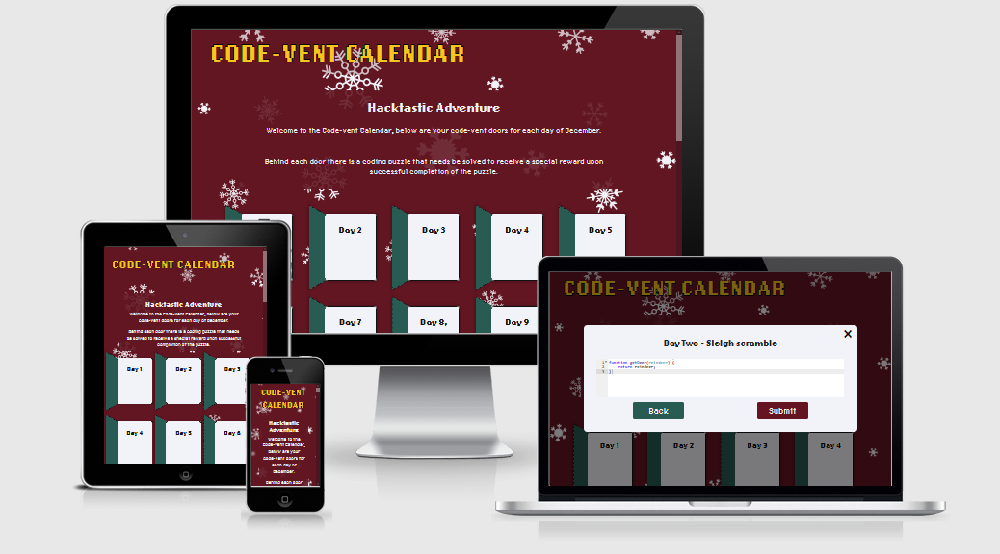

# CHRISTMAS HACKATHON

[Here is a link to the final project](https://manni8436.github.io/chrismas-hackathon/)

## INITIAL DESIGN
* The initial idea behind this project was to create a advent calendar style website, where the user 
would have to solve a code related challenge in which they would receive a special reward upon successful 
completion of the challenge.

* The main features that have been included are:
    * Easy to navigate the page.
    * Easy to read information.
    * A christmas related colour scheme that stands out, but not overwhelming.

## FINAL DESIGN

## CONTENTS

* [User Experience](#USER-EXPERIENCE)  
    * [User Stories](#USER-STORIES)    

* [Design](#DESIGN)   
    * [Color Scheme](#COLOR-SCHEME)

* [Wireframes](#WIREFRAMES) 

* [Technologies Used](#TECHNOLOGIES-USED) 
    * [Languages Used](#LANGUAGES-USED)
    * [Programs Used](#PROGRAMS-USED)

* [Deployment](#DEPLOYMENT)
    * [Initial Deployment](#INITIAL-DEPLOYMENT)
    * [How To Fork A Repository](#HOW-TO-FORK-A-REPOSITORY)
    * [How To Clone A Repository](#HOW-TO-CLONE-A-REPOSITORY)
    * [How To Make A Local Clone](#HOW-TO-MAKE-A-LOCAL-CLONE)

* [Testing](#TESTING)
    * [Code Validators](#CODE-VALIDATORS)

* [Content](#CONTENT)
    * [Images](#IMAGES)
    * [Text Content](#TEXT-CONTENT)

* [Acknowledgements](#ACKNOWLEDGEMENTS)    

## USER EXPERIENCE
The structure of the site was designed to be simple, easy to use and have a good content balance as to not
overload the user and give them enough information as not to leave them lost of needing more information in what to do.

* The website is for the following user types:
   
    * Users that have basic knowledge of coding, who are looking to try new things.
    * Users with advanced knowledge of coding and looking for a challenge.
    * Users with beyond advanved knowledge of coding who are looking for something fun to do.

[Back to top](#christmas-hackathon)

## USER STORIES

#### CLIENT GOALS
* The site needs to be easily accessible.
* The site needs to be simple to use on several devices including desktop, tablet and mobile.
* The site should be informative and all the text should be easy to read.
* The images should be clear and not stretched or squashed.

#### FIRST TIME VISITORS
* The site to be easy to understand and self explanatory.
* The site content to be easily read and understandble.

#### RETURNING USER
* To recommend the site to friends and family.
* To come back every year to see and try new challenges.

[Back to top](#christmas-hackathon)

## DESIGN

### COLOR SCHEME
This overall color scheme used throughout the site was the variety of colours in the image below.

This color theme was used to represent slightly off traditional christmas colors, which is world wide know to be green and red,
with hint of yellow and white for text on the site to stand out.

[Back to top](#christmas-hackathon)

## WIREFRAMES

* [Here is the main page wireframes](assets/images/readme/codevent-wireframe1.jpg)
* [Here is the code challenge wireframes](assets/images/readme/codevent-wireframe2.jpg)
* [Here is the code challenge input box wireframes](assets/images/readme/codevent-wireframe3.jpg)

[Back to top](#christmas-hackathon)

## FEATURES
The following features have been used in this project:

[Back to top](#christmas-hackathon)
    
## SOLVED BUGS

[Back to top](#christmas-hackathon)

## TECHNOLOGIES USED

###  LANGUAGES USED

       

[Back to top](#christmas-hackathon)

### PROGRAMS USED:

#### Font Awesome:
[Font Awesome](https://fontawesome.com/) was used for a few icons in the footer on all of this site's pages.

#### Adobe Fonts:
[Low-res](https://fonts.adobe.com/fonts/lo-res) from Adobe Fonts was used for all the text content on the site pages.

#### Git:
[Git](https://git-scm.com/) was used for version control by using the Gitpod terminal to add and commit to Git and push to Github.

#### GitPod:
[GitPod](https://gitpod.io) was used as an IDE whilst coding this site.
    
#### GitHub:
[GitHub](https://github.com/) is being used to store all the code for this project after being pushed from GitPod.

#### Am i Responsive:
[Am i Responsive](http://ami.responsivedesign.is/) was used to create the image in my [Final Design](#FINAL-DESIGN) section.

#### Adode:
[Adode](https://www.adobe.com/products/xd.html) was used in the initial design process to make wireframes.

[Back to top](#christmas-hackathon)

## DEPLOYMENT:

### INITIAL DEPLOYMENT

This site was deployed using GitHub Pages with the following the steps below:

1. Login or Sign Up to [GitHub](www.github.com).
2. Create a new repository named "chrismas-hackathon".
3. Once created, click on "Settings" on the navigation bar under the repository title.
4. Click on "Pages", on the left hand side below Secrets.
5. Under "Source", choose which branch you wish to deploy, In most cases it will be "main".
6. Choose which folder to deploy from, generally from "/root".
7. Click "Save", then wait for it to be deployed. It may take some time for the page to be fully deployed.
8. The URL will be displayed above the "source" section in GitHub Pages.

### HOW TO FORK A REPOSITORY

If you need to make a copy of a repository:

1. Login or Sign Up to [GitHub](www.github.com).
2. On GitHub, go to [manni8436/chrismas-hackathon](https://github.com/manni8436/chrismas-hackathon).
3. In the top right corner, click "Fork".

[Back to top](#christmas-hackathon)

### HOW TO CLONE A REPOSITORY

If you need to make a clone:    

1. Login in to [GitHub](www.github.com).
2. Fork the repository (add repo name here) using the steps above in [How To Fork a Repository](#HOW-TO-FORK-A-REPOSITORY).
3. Above the file list, click "Code".
4. Choose if you want to close using HTTPS, SSH or GitHub CLI, then click the copy button to the right.
5. Open Git Bash.
6. Change the directory to where you want your clone to go.
7. Type git clone and then paste the URL you copied in step 4.
8. Press Enter to create your clone.

### HOW TO MAKE A LOCAL CLONE

If you need to make a local clone:   

1. Login in to [GitHub](www.github.com).
2. Under the repository name, above the list of files, click "Code".
3. Here you can either Clone or Download the repository.
4. You should close the repository using HTTPS, clicking on the icon to copy the link.
5. Open Git Bash.
6. Change the current working directory to the new locaiton, where you want the cloned directory to be.
7. Type git clone and then paste the URL you copied in step 4.
8. Press Enter, and your local clone will be created.

[Back to top](#christmas-hackathon)

## TESTING

### CODE VALIDATORS

The W3C Markup Validator and W3C CSS Validator was used to validate my project to make sure there were no errors within the site.

* W3C HTML Validator Results
    
* W3C CSS Validator Results
    * [CSS]()

* JavaScript Validator

[Back to top](#christmas-hackathon)

### FULL TESTING

[Click Here](TESTING.md) to view the full testing steps that were completed on every device and browser.

### LIGHTHOUSE

### DESKTOP

### MOBILE

#### Performance:

#### Accessibility:

#### Best Practices:

#### SEO:

## CONTENT

### IMAGES

### TEXT CONTENT

[Back to top](#christmas-hackathon)

## ACKNOWLEDGEMENTS:

[Back to top](#christmas-hackathon)