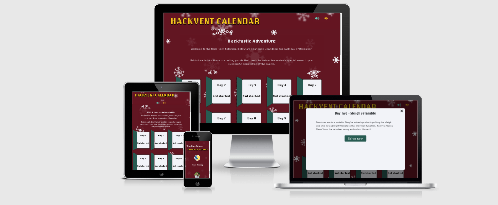
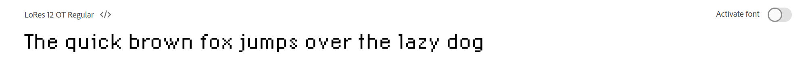
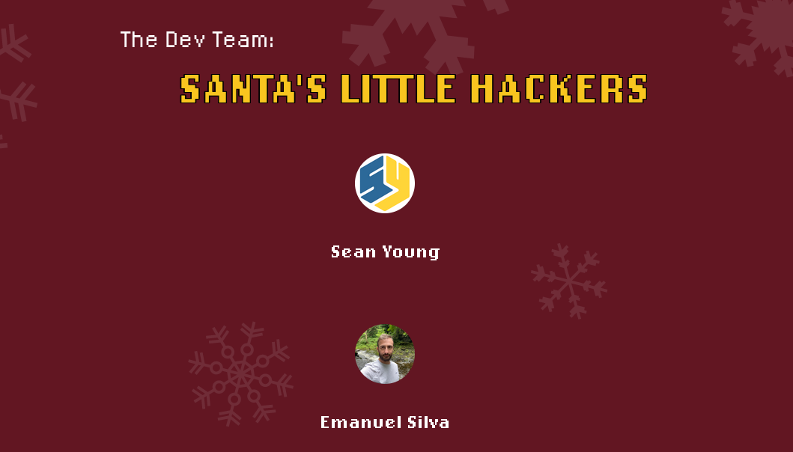
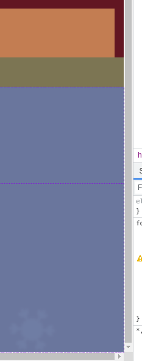
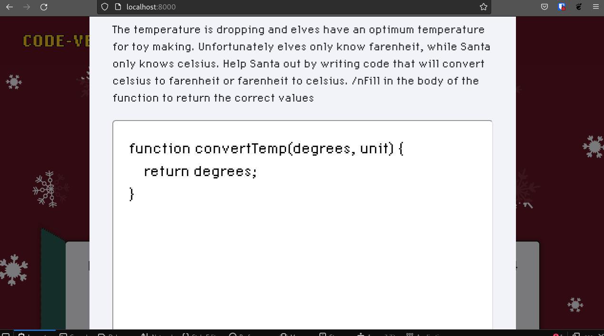
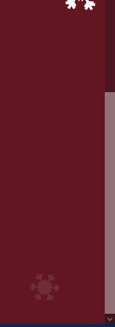
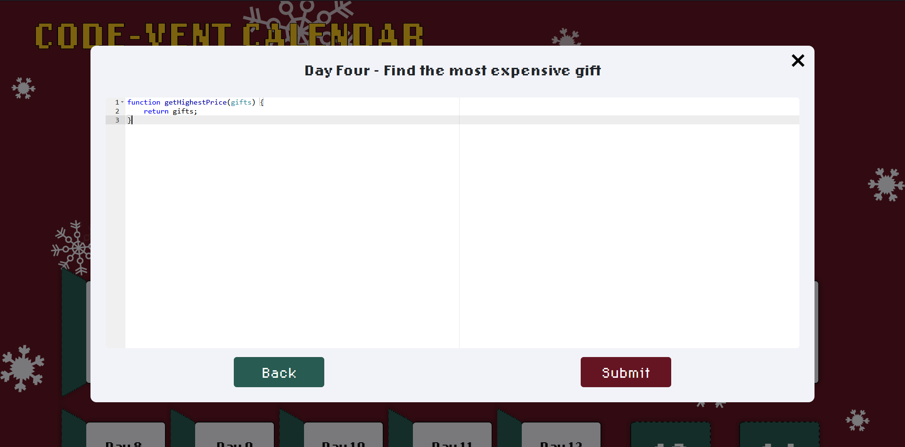

# CHRISTMAS HACKATHON

[Here is a link to the final project](https://manni8436.github.io/hackvent-calendar/)

## INITIAL DESIGN
* The initial idea behind this project was to create a advent calendar style website, where the user 
would have to solve a code related challenge in which they would receive a special reward upon successful 
completion of the challenge.

* The main features that have been included are:
    * Easy to navigate the page.
    * Easy to read information.
    * A christmas related colour scheme that stands out, but not overwhelming.

---

## FINAL DESIGN

## CONTENTS

* [**User Experience**](#USER-EXPERIENCE)  
    * [User Stories](#USER-STORIES)    

* [**Technologies Used**](#TECHNOLOGIES-USED) 

* [**Design**](#DESIGN)   
    * [Color Scheme](#COLOR-SCHEME)

* [**Wireframes**](#WIREFRAMES) 

* [**Bugs**](#BUGS) 
    * [Bugs Found](#BUGS-FOUND)
    * [Solved Bugs](#SOLVED-BUGS) 

* [**Deployment**](#DEPLOYMENT)
    * [Initial Deployment](#INITIAL-DEPLOYMENT)
    * [How To Fork A Repository](#HOW-TO-FORK-A-REPOSITORY)
    * [How To Clone A Repository](#HOW-TO-CLONE-A-REPOSITORY)
    * [How To Make A Local Clone](#HOW-TO-MAKE-A-LOCAL-CLONE)

* [**Full Testing**](#FULL-TESTING)

* [**Credits**](#CREDITS)

* [**Acknowledgements**](#ACKNOWLEDGEMENTS)

---

## USER EXPERIENCE
The structure of the site was designed to be simple, easy to use and have a good content balance as to not
overload the user and give them enough information as not to leave them lost of needing more information in what to do.

* The website is for the following user types:
   
    * Users that have basic knowledge of coding, who are looking to try new things.
    * Users with advanced knowledge of coding and looking for a challenge.
    * Users with beyond advanved knowledge of coding who are looking for something fun to do.

[Back to top](#christmas-hackathon)

---
## USER STORIES

#### CLIENT GOALS
* The site needs to be easily accessible.
* The site needs to be simple to use on several devices including desktop, tablet and mobile.
* The site should be informative and all the text should be easy to read.
* The images should be clear and not stretched or squashed.

#### FIRST TIME VISITORS
* The site to be easy to understand and self explanatory.
* The site content to be easily read and understandable.

#### RETURNING USER
* To recommend the site to friends and family.
* To come back every year to see and try new challenges.

[Back to top](#christmas-hackathon)

---
## TECHNOLOGIES USED

###  Languages were used:

   
- [HTML](https://developer.mozilla.org/en-US/docs/Web/HTML) - was used as the foundation of the site.
- [CSS](https://developer.mozilla.org/en-US/docs/Web/css) - was used to add the styles and layout of the site.
- [CSS Flexbox](https://developer.mozilla.org/en-US/docs/Learn/CSS/CSS_layout/Flexbox) - was used to arrange items symmetrically on the pages.
- [CSS Grid](https://developer.mozilla.org/en-US/docs/Web/CSS/grid) - was used to make "doors" and "footer" pages responsive.
- [CSS roots](https://developer.mozilla.org/en-US/docs/Web/CSS/:root) - was used to declaring global CSS variables and apply them throughout the project.
- [JS](https://www.javascript.com/) - was used to make calculations and display content on the page.

## Additionally:

- [jQuery Library](https://jquery.com/) was used to handle event handling, animations, and traverse and manipulate DOM. 
- [ACE](https://ace.c9.io/) was used to embed code editor into the code window.
- [Bootstrap](https://getbootstrap.com/)
- [Font Awesome](https://fontawesome.com/) was used for a few icons in the footer on all of this site's pages.
- [Adobe Fonts Lo-Res](https://fonts.adobe.com/fonts/lo-res) from Adobe Fonts was used for all the text content on the site pages.
- [VSCode](https://code.visualstudio.com/) was used as the main tool to write and edit code.
- [Git](https://git-scm.com/) was used for version control by using the Gitpod terminal to add and commit to Git and push to Github.
- [GitPod](https://gitpod.io) was used as an IDE whilst coding this site.
- [GitHub](https://github.com/) is being used to store all the code for this project after being pushed from GitPod.
- [Am i Responsive](http://ami.responsivedesign.is/) was used to create the image in my [Final Design](#FINAL-DESIGN) section.
- [Adode](https://www.adobe.com/products/xd.html) was used in the initial design process to make wireframes.

[Back to top](#christmas-hackathon)

---
## DESIGN

### COLOR SCHEME
This overall color scheme used throughout the site was the variety of colours in the image below.

This color theme was used to represent slightly off traditional christmas colors, which is world wide know to be green and red,
with hint.

1. Persian Plum Color (#621622) *was chosen as a background color to create nice contrast with the rest of the content.*
1. Blue Green Color Wheel (#285B52) *was chosen for the doors of the challenges to create the contrast with the background image and to guide the user to click on a door challenge.*
1. Keppel Color (#58B69B) *was chosen as a background of the last door reward to emphasis that the user finished all challenges.*
1. Ghost White Color(#F2F3F8) *was chosen as a primary text color to increase readability.*
1. Saffron Color (#F8C51F) *was chosen as an accent color to make the name of the website and the name of the team more noticeable.*

* ### FONT FAMILY

[Font Family LoRes 12 OT Regular](https://fonts.adobe.com/fonts/lo-res) was chosen to create the atmosphere of an old computer game as this font makes a synthesis of pixelated designs.

[Back to top](#christmas-hackathon)

---
## WIREFRAMES

* [Here is the main page wireframes](documentation/wireframes/codevent-wireframe1.jpg)
* [Here is the code challenge wireframes](documentation/wireframes/codevent-wireframe2.jpg)
* [Here is the code challenge input box wireframes](documentation/wireframes/codevent-wireframe3.jpg)

## FEATURES
The following features have been used in this project:
* Hover
    * Tells the user solve now, submit and back buttons are highlighted.
    * Mouse pointer changes to a hand to indicate a clickable area.

* Sound
    * Sound can be heard when the advent door is clicked opened.
    * The user can turn the sound off.

[Back to top](#christmas-hackathon)

---
## BUGS

### BUGS FOUND

1. While creating the footer, the bug below was found on the firefox browser where the footer github image links would sit horizontal on the page instead of vertical.

2. A horizontal overflow was found after the footer was created.

3. While working on the code window, it would overflow the screen height and couldn't be scrolled, leading to parts of the interface being inaccessible.

### SOLVED BUGS

1. In the `footer`, the width value was changed from `100vw` to `100%` and also in the `links-holder` class selector the `max-width`
was changed from `80%` to `80vw` and added `padding-left: 0;` and the results are shown below.

2. To resolve this issue, `width: 100vw;` was removed from the `footer` selector.

3. In order to fix the code window bug, two additions were made in `body.code`, `max-height: 70vh;` and `overflow-y: auto;` was added.

[Back to top](#christmas-hackathon)

---
## DEPLOYMENT:

### INITIAL DEPLOYMENT

This site was deployed using GitHub Pages with the following the steps below:

1. Login or Sign Up to [GitHub](www.github.com).
2. Create a new repository named "hackvent-calendar".
3. Once created, click on "Settings" on the navigation bar under the repository title.
4. Click on "Pages", on the left hand side below Secrets.
5. Under "Source", choose which branch you wish to deploy, In most cases it will be "main".
6. Choose which folder to deploy from, generally from "/root".
7. Click "Save", then wait for it to be deployed. It may take some time for the page to be fully deployed.
8. The URL will be displayed above the "source" section in GitHub Pages.

### HOW TO FORK A REPOSITORY

If you need to make a copy of a repository:

1. Login or Sign Up to [GitHub](www.github.com).
2. On GitHub, go to [hackvent-calendar](https://github.com/manni8436/hackvent-calendar).
3. In the top right corner, click "Fork".

[Back to top](#christmas-hackathon)

### HOW TO CLONE A REPOSITORY

If you need to make a clone:    

1. Login in to [GitHub](www.github.com).
2. Fork the repository [hackvent-calendar](https://github.com/manni8436/hackvent-calendar) using the steps above in [How To Fork a Repository](#HOW-TO-FORK-A-REPOSITORY).
3. Above the file list, click "Code".
4. Choose if you want to close using HTTPS, SSH or GitHub CLI, then click the copy button to the right.
5. Open Git Bash.
6. Change the directory to where you want your clone to go.
7. Type git clone and then paste the URL you copied in step 4.
8. Press Enter to create your clone.

### HOW TO MAKE A LOCAL CLONE

If you need to make a local clone:   

1. Login in to [GitHub](www.github.com).
2. Under the repository name, above the list of files, click "Code".
3. Here you can either Clone or Download the repository.
4. You should close the repository using HTTPS, clicking on the icon to copy the link.
5. Open Git Bash.
6. Change the current working directory to the new locaiton, where you want the cloned directory to be.
7. Type git clone and then paste the URL you copied in step 4.
8. Press Enter, and your local clone will be created.

[Back to top](#christmas-hackathon)

---

## FULL TESTING

[Click Here](TESTING.md) to view the full testing steps that were completed on every device and browser.

---

## CREDITS

* Lo-Res font-family was imported from [Adobe Fonts](https://fonts.adobe.com/).
* Background image & reward images created using [Canva](https://www.canva.com/).
* Door opening audio sourced from [Zapsplat.com](https://www.zapsplat.com/music/card-chocolate-filled-advent-calender-door-open/).
* The inspiration for the color scheme was taken from the website [Sarah Renae Clark](https://sarahrenaeclark.com/25-christmas-color-palettes/).
* Content of the challenges was mode by the members of "Santa lil' Hackers".
* To implement code editor was used [ACE](https://ace.c9.io/).
* Icons were sources from [Font Awesome](https://fontawesome.com/).

[Back to top](#christmas-hackathon)

---

## ACKNOWLEDGEMENTS:

[Back to top](#christmas-hackathon)