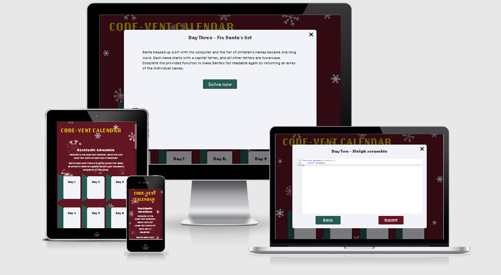

## **Contents**

* [**Testing**](#testing)
  * [**Navigation**](#navigation)
  * [**Advent Calendar Door**](#advent-calendar-door)
  * [**Pop Up Box Puzzle Instructions**](#pop-up-box-puzzle-instructions)
  * [**Github image links**](#github-image-links)
  * [**Github image links**](#github-image-links)
  
  
# **Testing**

### **Navigation** 

| Feature      | Expected          | Testing  | Result | Pass/Fail |
|-------------|-------------|-----|----------|:----:|
| Code-Vent Calendar Page Title | To redirect to home page | Clicked Code-Vent Calendar Page Title | Title navigates to home page | Pass |

### **Advent Calendar Door**

| Feature      | Expected  | Testing  | Result | Pass/Fail |
|-------------|-------------|-----|----------|:-----:|
| Door Opening upon page load | When site loads, door opens until day before current date | Reload page | door opens until day before current date | Pass |
| Clicking door for pop-up box puzzle instructions | Expected the pop-up box to appear upon clicking on door | Click On Door | pop-up box appears when door is clicked | Pass |
| Door Opening Sound | Sound to happen upon clicking on door | Click on door | Sound happens upon clicking on door | Pass |

### **Pop-Up Box Puzzle Instructions**

| Feature     | Expected  | Testing  | Result | Pass/Fail |
|-------------|-------------|-----|----------|:-----:|
| Pressing Solve Now Button | Coding challenge input puzzle box to open | Press Solve Now Button | Input box opens upon clicking door | Pass |
| Pressing Back Button | To go back to pop-up puzzle instructions | Press Back Button | Goes back to pop-up puzzle instructions | Pass |
| Pressing X Button on puzzle instruction | Closes instruction box | Press X Button | Closes instruction box | Pass |
| Pressing X Button | Closes puzzle input box | Press X Button | Closes puzzle input box | Pass |
| Pressing Submit Button | submit puzzle code  | press submit button | Submits input code | Pass |

[Back to contents](#contents)
