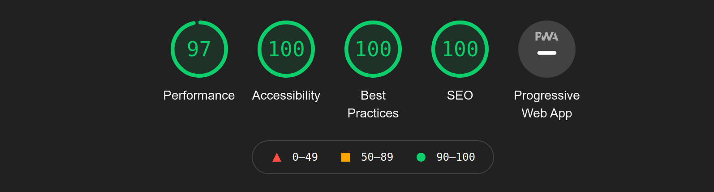
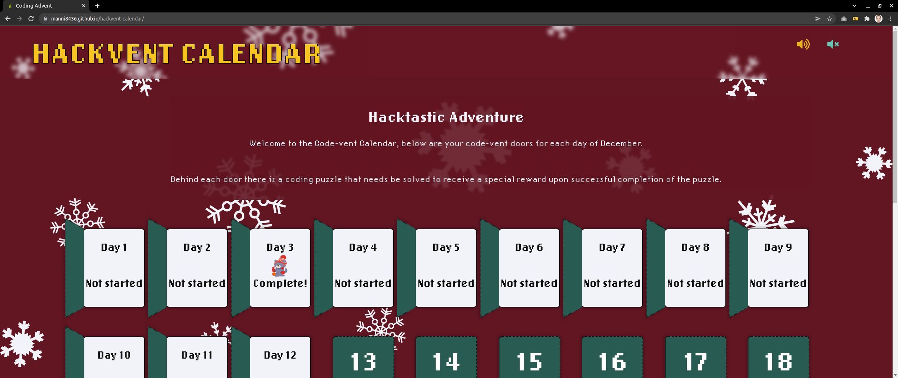
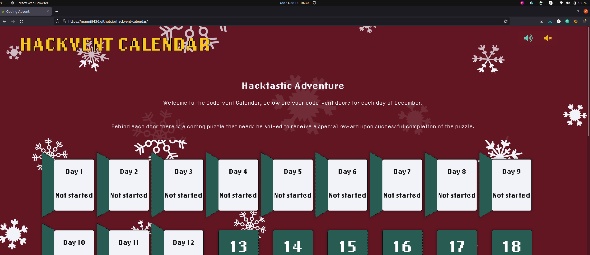
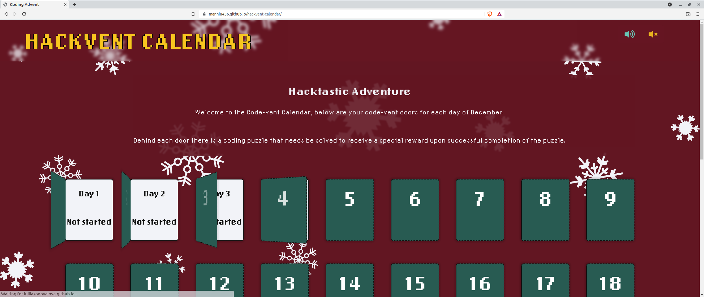
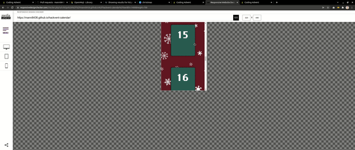
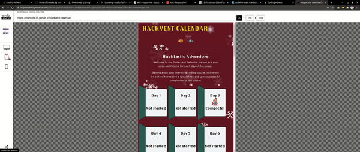
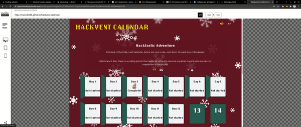
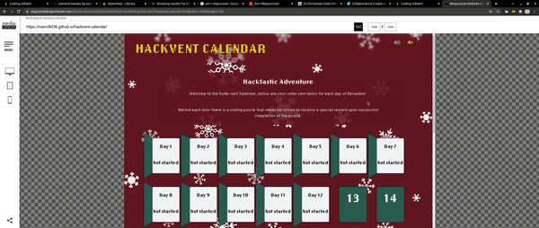

## **Contents**

* [**Testing**](#testing)
  * [**Navigation**](#navigation)
  * [**Advent Calendar Door**](#advent-calendar-door)
  * [**Pop Up Box Puzzle Instructions**](#pop-up-box-puzzle-instructions)
  * [**Github image links**](#github-image-links)
  * [**Github image links**](#github-image-links)
  * [**Validator testing**](#Validator-testing)
    * [**HTML Validation**](#HTML-Validation)
    * [**CSS Validation**](#CSS-Validation)
    * [**JS Validation**](#JS-Validation)
  * [**Lighthouse report**](#Lighthouse-Report)
  * [**Compatibility**](#Compatibility)
  * [**Responsiveness**](#Responsiveness)
  * [**Functionality**](#Functionality)

# **Testing**

### **Navigation** 

| Feature      | Expected          | Testing  | Result | Pass/Fail |
|-------------|-------------|-----|----------|:----:|
| Code-Vent Calendar Page Title | To redirect to home page | Clicked Code-Vent Calendar Page Title | Title navigates to home page | Pass |

### **Advent Calendar Door**

| Feature      | Expected  | Testing  | Result | Pass/Fail |
|-------------|-------------|-----|----------|:-----:|
| Door Opening upon page load | When site loads, door opens until day before current date | Reload page | door opens until day before current date | Pass |
| Clicking door for pop-up box puzzle instructions | Expected the pop-up box to appear upon clicking on door | Click On Door | pop-up box appears when door is clicked | Pass |
| Door Opening Sound | Sound to happen upon clicking on door | Click on door | Sound happens upon clicking on door | Pass |

### **Pop-Up Box Puzzle Instructions**

| Feature     | Expected  | Testing  | Result | Pass/Fail |
|-------------|-------------|-----|----------|:-----:|
| Pressing Solve Now Button | Coding challenge input puzzle box to open | Press Solve Now Button | Input box opens upon clicking door | Pass |
| Pressing Back Button | To go back to pop-up puzzle instructions | Press Back Button | Goes back to pop-up puzzle instructions | Pass |
| Pressing X Button on puzzle instruction | Closes instruction box | Press X Button | Closes instruction box | Pass |
| Pressing X Button | Closes puzzle input box | Press X Button | Closes puzzle input box | Pass |
| Pressing Submit Button | submit puzzle code  | press submit button | Submits input code | Pass |

### **Coding Puzzle Testing**

| Feature     | Expected  | Testing  | Result | Pass/Fail |
|-------------|-------------|-----|----------|:-----:|
| Testing puzzles | Expecting all input area to be typable, submitable | Attempt to solve puzzles | Solved puzzles and able to submit them | Pass|
| Submiting Code Solution | Expecting solution to be adviced that it is correct | Attempt to submit puzzles | submit puzzles and receive success message and reward | Pass|

[Back to contents](#contents)

---

## Validator testing

### HTML Validation

- No errors or warnings were found when passing through the official [W3C](https://validator.w3.org/) validator.

* [HTML](https://validator.w3.org/nu/?doc=https%3A%2F%2Fmanni8436.github.io%2Fhackvent-calendar%2F)

### CSS Validation

- No errors were found when passing through the official [W3C (Jigsaw)](https://jigsaw.w3.org/css-validator/#validate_by_uri) validator: 
    * [CSS](https://jigsaw.w3.org/css-validator/validator?uri=https%3A%2F%2Fmanni8436.github.io%2Fhackvent-calendar%2F&profile=css3svg&usermedium=all&warning=1&vextwarning=&lang=en)
- The CSS validator shows the multiple warning regardless the use of webkit and clip property. However, everything works perfectly well without any issues.

### JS Validation
*  js files were checked by the official [JSHint](https://jshint.com/):
    * [script.js](documentation/js_validation/jshint_script.png);
    * [day1.mjs](documentation/wireframes/jshint_day1.png);
    * [day2.mjs](documentation/wireframes/jshint_day2.png);
    * [day3.mjs](documentation/wireframes/jshint_day3.png);
    * [day4.mjs](documentation/wireframes/jshint_day4.png);
    * [day5.mjs](documentation/wireframes/jshint_day5.png);
    * [day6.mjs](documentation/wireframes/jshint_day6.png);
    * [day7.mjs](documentation/wireframes/jshint_day7.png);
    * [day8.mjs](documentation/wireframes/jshint_day8.png);
    * [day9.mjs](documentation/wireframes/jshint_day9.png);
    * [day10.mjs](documentation/wireframes/jshint_day10.png);
    * [day11.mjs](documentation/wireframes/jshint_day11.png);
    * [day12.mjs](documentation/wireframes/jshint_day12.png);
    * [day13.mjs](documentation/wireframes/jshint_day13.png);
    * [day14.mjs](documentation/wireframes/jshint_day14.png);
    * [day15.mjs](documentation/wireframes/jshint_day15.png);
    * [day16.mjs](documentation/wireframes/jshint_day16.png);
    * [day17.mjs](documentation/wireframes/jshint_day17.png);
    * [day18.mjs](documentation/wireframes/jshint_day18.png);
    * [day19.mjs](documentation/wireframes/jshint_day19.png);
    * [day20.mjs](documentation/wireframes/jshint_day20.png);
    * [day21.mjs](documentation/wireframes/jshint_day21.png);
    * [day22.mjs](documentation/wireframes/jshint_day22.png);
    * [day23.mjs](documentation/wireframes/jshint_day23.png);
    * [day24.mjs](documentation/wireframes/jshint_day24.png);
    * [day25.mjs](documentation/wireframes/jshint_day25.png);

[Back to top](#christmas-hackathon)
## Lighthouse Report

## Compatibility:

+ The app was tested on the following browsers: Chrome, Firefox, Brave, Edge:

  - Chrome:

  
  
  - Firefox:

  

  - Brave:

  
## Responsiveness:

+ The app was checked with [Responsive Website Design Tester](https://responsivedesignchecker.com/).

  1. Mobile Screens:

    - Mobile 320x480, 320x568, 360x640, 375x667, 384x640, 411x731, 414x736:

     

      
  1. Tablets Screens:

    - Tablet 600x960, 768x1024, 800x1280, 1366x1024, 1600x900, 1680x1050, 1920x1080, 1920x1200:
        
    
      
  1. Desktop Screens:

    - Desktop 1024x600, 1024x800, 1366x768, 1440x900:
        
    

## Functionality:

The functionality of the links in the app was checked as well by different users.

 